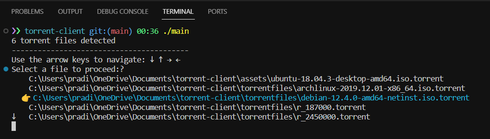

# torrent-client

Tiny bit torrent client written in go. Originally inspired from [build-your-own-x](https://blog.jse.li/posts/torrent/) (this is perhaps one of the most iconic repository I have came across on github)

> BitTorrent is the ideal way to transfer large files to thousands of locations in a short period of time. This doesn't only apply to movies and music that are downloaded by the average BitTorrent user, companies can benefit from it as well. With help from BitTorrent, Facebook can now push hundreds of megabytes of new code to all servers worldwide in just a minute.


This is a lightweight software application designed to download and upload files using the BitTorrent protocol. BitTorrent is a peer-to-peer (P2P) communication protocol widely used for distributing large amounts of data over the internet. The protocol enables efficient sharing of files by dividing them into smaller pieces, which are then distributed among multiple users (peers).

Many companies use the BitTorrent protocol, including Facebook, Twitter, Wikipedia, and Blizzard. Watch [this](https://torrentfreak.com/facebook-uses-bittorrent-and-they-love-it-100625/) to learn more about how Facebook uses BitTorrent protocol and why they love it.

An amazing blog post by [veggiedefender](https://blog.jse.li/posts/torrent/)

## Getting Started

### Prerequisites

- [Go](https://golang.org/dl/): Make sure you have Go installed on your system.

### Installing Dependencies

```bash
go get -u github.com/adimail/torrent-client/internal/torrentfile
go get -u github.com/manifoldco/promptui
```

#### Compiling the program

```bash
go build cmd/torrent-client/main.go
```

#### Run

```bash
./main
```

Through a user interface, select the torrent file you would like to download and hot enter. The downloaded files will be saved in `downloads` directory.

Use the arrow keys to navigate: ↓ ↑ → ←



## Demo


---

### .torrent files

Contains the information about the file we want to download. Each torrent is independent.

- **Seeders:** Seeders are seeding the data in the network. At least one seeder.
- **P2P:** No indicative for anyone to join a torrent and become a seeder.
- A user downloads the torrent file from the internet via a normal HTTP request. We can discard the torrent file upon download completion.
- We can either discard the file or we ourselves become the seeder for anyone who wants to download the file. We become a seeder from a leecher.

## What torrent file contains

Holds meta information.

1. **Announce:** Announce of the URL.
2. **Created by:** Name and version of the program that created it.
3. **Creation date:** Creating time of the torrent in UNIX epoch.
4. **Encoding:** Encoding of strings (utf-8) as part of the info dictionary.
5. **Comment:** Information.
6. **Info:** Dictionary that describes files of the torrent.
   - **Single file format:**
     - Name: Filename
     - Length: File size
     - Mdsum: MD5 of the file
   - **Multifile format:**
     - Name: Name of the dictionary
     - Files: List of dictionaries
       - Length: Length
       - Mdsum: MD5 sum of the title
       - Path: List representing the path
         - Format: /a/b/c.txt -> [a, b, c.txt]

- Storing the path as a list of strings; they store it as an array because different operating systems have different separators.

## But where is the information about the file data?

The info dict also contains:

1. **Piece length:** Number of bytes in each piece.
2. **Pieces:** 20 bytes SHA1 hash value concatenated.
   - piece1 -> SHA1 -> S1
   - piece2 -> SHA2 -> S2
   - piece3 -> SHA3 -> S3

- Then we concatenate S1 + S2 + S3.

## Torrent file format: Bencoding (not JSON)

Torrent files are "Bencoded," and to extract the above fields, we would need to parse the torrent file.

## Bencoding specification

Supports: Strings, lists, integers, dictionaries.

1. **Strings:**
   - Format: `<length>: <string>`
   - Example: `"Aditya"` -> `6:Aditya`
2. **Integers:**
   - Format: `i<int>e`
   - Example: `10` -> `i10e`
3. **List:**
   - Format: `l<bencoded values>`
   - Example: `["a", "b", 1]` -> `l 1:a 1:b i1e e`
4. **Dictionary:**
   - Format: `d<bencoded string><bencoded value>...e`
   - Example: `{"a": 1, "b":2}` -> `d 1:a i1e 1:b i2e e`

- It is very fun to write your own Bencoding parser.

**Pieces and piece size are very important.**

### External Packages

- [github.com/manifoldco/promptui](https://github.com/manifoldco/promptui)
- [github.com/jackpal/bencode-go](https://github.com/jackpal/bencode-go)
- [github.com/schollz/progressbar/v3](https://github.com/schollz/progressbar/v3)
